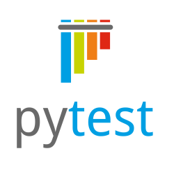

# CS101 Data Structures

Activity 05: Introduction to Software Testing with pytest

## Assigned and Due

- **Assigned**: Wednesday, 7 October 2026 at start of class
- **Due and Expiration**: Monday, 12 October 2026 at start of class

Note: the expiration date is the last date you can submit your work for a grade.

<center>



</center>

## Table of Contents
- [CS101 Data Structures](#cs101-data-structures)
  - [Assigned and Due](#assigned-and-due)
  - [Table of Contents](#table-of-contents)
  - [Overview](#overview)
  - [Learning Objectives](#learning-objectives)
  - [Project Goals](#project-goals)
  - [Instructions](#instructions)
  - [Deliverable](#deliverable)
  - [Submission](#submission)
  - [GatorGrade](#gatorgrade)
  - [Seeking Assistance](#seeking-assistance)


## Overview

In this activity you will complete three tutorials that introduce automated testing in Python with `pytest`. You will use the `uv` package manager to create environments, install dependencies, and run your programs and tests from the command line.

The tutorials progress in difficulty:

1. Build your first passing `pytest` tests for a Fibonacci program
2. Use tests to isolate and repair small TODO bugs in Python functions
3. Automate test execution for a longer math-and-plotting pipeline

## Learning Objectives

By completing this activity, you will be able to:

1. **Set up and run `pytest` projects** using `uv` and command-line workflows
2. **Write basic unit tests** using `assert` and exception checks
3. **Use failing tests to debug code** and complete TODO-driven fixes
4. **Automate testing workflows** with a Python script that runs and reports test results


## Project Goals

- Create and use Python environments with `uv`
- Install and use `pytest` for test-driven debugging
- Practice fixing small errors in loops, lists, and conditionals
- Automate repeated test runs for a longer program


## Instructions

Complete the tutorials in order. Each tutorial includes setup commands, code, and expected output.

1. [Tutorial 1: First Tests with Fibonacci](tutorials/tutorial_01/tutorial_01.md)
2. [Tutorial 2: Find and Fix TODO Bugs](tutorials/tutorial_02/tutorial_02.md)
3. [Tutorial 3: Automate Testing for a Data Pipeline](tutorials/tutorial_03/tutorial_03.md)

For each tutorial directory:

```bash
cd tutorials/tutorial_0X
uv init --bare # create only pyproject.toml file
uv add <library>
uv run <program>
```

Use `uv add pytest` in Tutorials 1 and 2, and `uv add matplotlib` in Tutorial 3.

These tutorials intentionally avoid `source .venv/bin/activate` because activation commands vary across operating systems and shells. Running tools with `uv run <program>` is consistent on macOS, Linux, and Windows.

When plotting is required (Tutorial 3), add matplotlib:

```bash
uv add matplotlib
```

Run tests with:

```bash
uv run pytest -q src
```


## Deliverable

*Note: This is a check mark grade.*

After you finish the tutorials, complete the writing assessment in [writing/reflection.md](writing/reflection.md).

You are submitting:

- **Tutorial 01** (source and test files):
  - `tutorials/tutorial_01/src/fibonacci.py`
  - `tutorials/tutorial_01/src/test_fibonacci.py`
- **Tutorial 02** (source and test files):
  - `tutorials/tutorial_02/src/sequence_tools.py`
  - `tutorials/tutorial_02/src/test_sequence_tools.py`
- **Tutorial 03** (source and test files):
  - `tutorials/tutorial_03/src/analysis_pipeline.py`
  - `tutorials/tutorial_03/src/test_analysis_pipeline.py`
  - `tutorials/tutorial_03/src/run_tests.py`
- **Reflection**:
  - `writing/reflection.md`


## Submission

Please commit and push your work regularly. Example commands:

```bash
git add -A
git commit -m "Describe your changes"
git push
```

After pushing, verify that your files appear in your GitHub repository.


## GatorGrade

You can check baseline requirements with:

```bash
gatorgrade --config config/gatorgrade.yml
```


## Seeking Assistance

Students who have questions about this project outside of lab time are invited to ask in the course Discord channel or during office hours.
